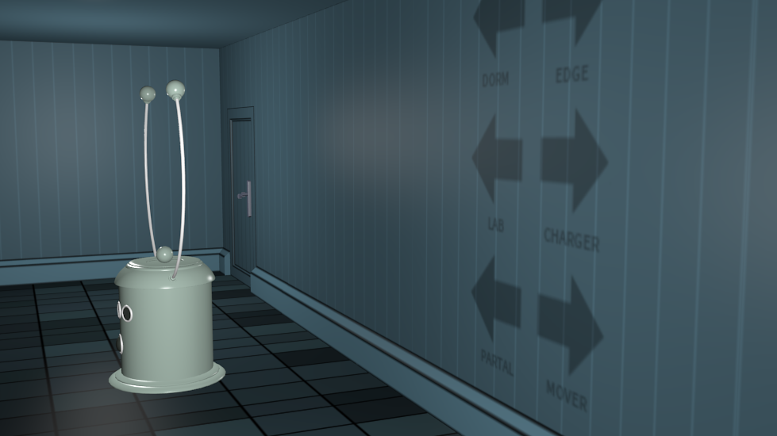

# Subnet3d - 3d版的Subnet

用blender做的Subnet的三维模型。准备做成3D版的Subnet。

3D models and scenes in Subnet made with blender.I'm planning making a 3D version of the Subnet.

## 目录结构
./common下面放的是很多场景里面重复出现的模型，如传送机等，./locations里面是各个场景的目录。

## Credits
场景结构、贴图以及想法都来自Mateusz Skutnik的[Submachine系列](http://www.mateuszskutnik.com/submachine/)，以及工程[Submachine Universe](https://mateuszskutnik.itch.io/submachine-universe)。

The structure of the scenes,textures and the original idea all come from Mateusz Skutnik's excellent puzzle game series [Submachine](http://www.mateuszskutnik.com/submachine/),and his project [Submachine Universe](https://mateuszskutnik.itch.io/submachine-universe).
